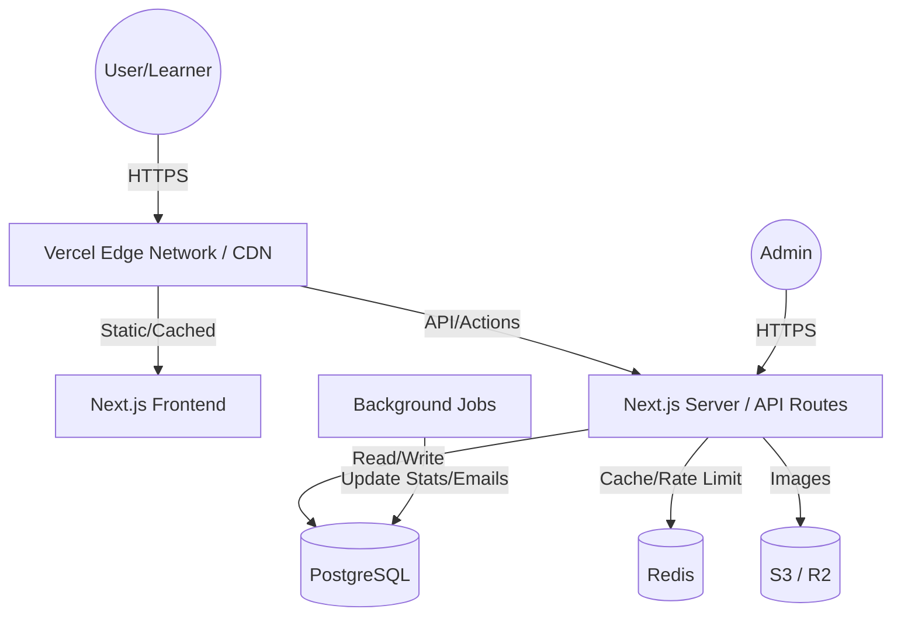
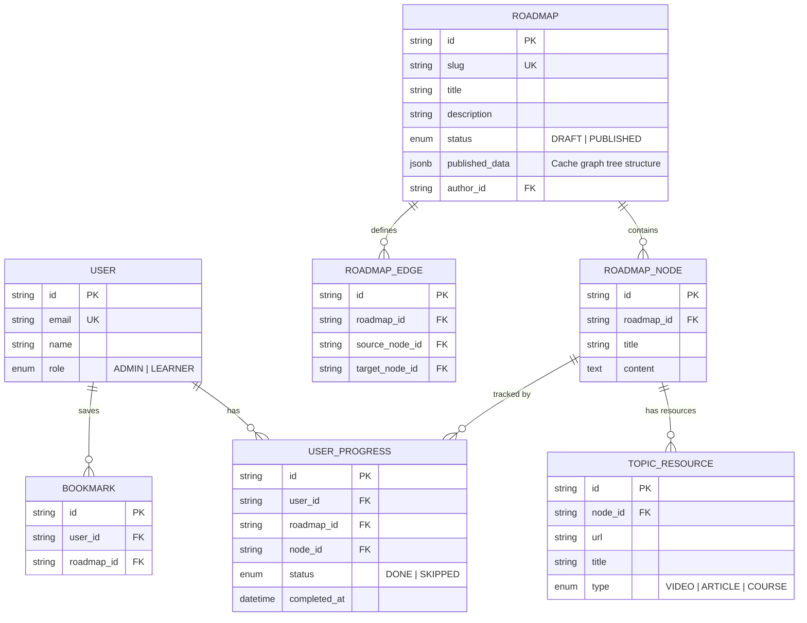

# Kiến trúc Nền tảng Roadmap - Phase 0 & Phase 1

## PHẦN A - PHASE 0: PRODUCT & ARCHITECTURE DISCOVERY

### 1. Phân tích bài toán sản phẩm
- **Mục tiêu cốt lõi:** Cung cấp lộ trình học tập (roadmap) trực quan, chuẩn xác giúp lập trình viên định hướng nghề nghiệp và theo dõi tiến độ.
- **Giá trị chính:** Tiết kiệm thời gian tìm kiếm tài liệu, giảm bớt sự hoang mang ("tutorial hell"), tạo động lực học tập qua việc tracking progress rõ ràng.
- **User personas chính:**
  - *Learner (Beginner/Mid-level):* Người cần lộ trình học tập, tìm kiếm tài liệu, theo dõi tiến độ.
  - *Admin/Content Creator (Internal Team):* Người tạo, cấu trúc, duy trì và cập nhật các roadmap.
- **Primary use cases:**
  - Khám phá các roadmap theo nghề nghiệp (Frontend, Backend, DevOps...).
  - Xem chi tiết một node (topic) trong roadmap và các tài nguyên học tập liên quan.
  - Đăng ký/Đăng nhập để lưu trạng thái học tập (Done, In Progress, Skip).
  - Quản trị viên tạo/sửa đổi/publish roadmap.
- **Secondary use cases:**
  - Bookmark/Favorite roadmap hoặc tài liệu.
  - Tìm kiếm roadmap hoặc topic.
- **Capabilities bắt buộc cho MVP:**
  - Xem public roadmap (SEO-friendly).
  - Chi tiết topic/node.
  - Authentication (Đăng nhập/Đăng ký cơ bản).
  - Progress tracking cơ bản.
  - CMS/Admin panel (nội bộ) để quản lý roadmap.
- **Capabilities nên để sau (tránh over-engineering):**
  - User tự tạo roadmap cá nhân (Custom roadmap).
  - Community Contribution/UGC (User Generated Content).
  - Social features (Comments, Upvotes).
  - Gamification (Badges, Leaderboard) phức tạp.
  - AI recommendations.

### 2. Product scope cho giai đoạn đầu
- **MVP Scope (Time-to-market: ~3 tháng):**
  - *Must-have:* Public pages SEO tốt (SSR/SSG), hệ thống Admin quản trị nội dung roadmap, Authentication cơ bản, Progress tracking cho user, cấu trúc roadmap hiển thị dạng tree/graph đơn giản.
  - *Should-have:* Search cơ bản (PostgreSQL Full-text search), Bookmark.
  - *Nice-to-have:* Dark/Light mode, Analytics cơ bản.
- **Version 1 Scope (Sau MVP):** Cải thiện UI/UX, thêm các loại roadmap phức tạp hơn, có thể thêm hệ thống gợi ý bài viết, user profile.
- **Tuyệt đối chưa nên làm:** Xây dựng platform cho user tự tạo roadmap (phức tạp về versioning và ownership), Microservices (không cần thiết với traffic vài chục nghìn), Notification real-time.

### 3. Domain discovery (Bounded Contexts)
Dựa theo DDD (Domain-Driven Design), ở mức độ MVP, ta có các domain sau:
1. **Roadmap Catalog (Core Domain):**
   - *Trách nhiệm:* Quản lý cấu trúc roadmap, version, nodes, edges, topic resources.
   - *Dữ liệu:* Roadmap, RoadmapVersion, RoadmapNode, TopicResource.
   - *Quan hệ:* Độc lập cao, cung cấp dữ liệu cho Learning Progress và Search.
   - *Độ ưu tiên:* Cao nhất (Must-have).
2. **Identity & Access Management (Generic Subdomain):**
   - *Trách nhiệm:* Quản lý user, authentication, authorization (Admin vs User).
   - *Dữ liệu:* User, Session, Role.
   - *Quan hệ:* Cung cấp UserID cho các domain khác.
   - *Độ ưu tiên:* Cao (Must-have).
3. **Learning Progress (Core/Supporting Domain):**
   - *Trách nhiệm:* Theo dõi trạng thái học tập của user trên các node.
   - *Dữ liệu:* UserProgress, Bookmark.
   - *Quan hệ:* Phụ thuộc vào Identity (UserID) và Roadmap Catalog (NodeID).
   - *Độ ưu tiên:* Cao (Must-have).
4. **Search (Supporting Subdomain):**
   - *Trách nhiệm:* Tìm kiếm nội dung.
   - *Độ ưu tiên:* Trung bình (Có thể dùng DB full-text search ở MVP).

### 4. Kiến trúc tổng thể giai đoạn đầu
**So sánh các lựa chọn:**
- **Monolith (Truyền thống):** Tốc độ phát triển nhanh nhất, deploy dễ, nhưng code dễ bị rối (spaghetti) nếu không có kỷ luật.
- **Modular Monolith:** Cấu trúc code chia theo Domain (Modules), chạy chung một process/deploy. Phát triển nhanh, deploy đơn giản, dễ scale code, dễ tách microservices sau này.
- **Microservices:** Phức tạp vận hành (Network, DB sync, DevOps), tốn chi phí, tốc độ phát triển chậm giai đoạn đầu. Phù hợp scale tổ chức lớn.

**Đề xuất:** **Modular Monolith** sử dụng **Next.js (App Router) kết hợp Server Actions / Route Handlers**.
- *Lý do:* Theo định hướng dùng hệ sinh thái Next.js/Prisma, ta hoàn toàn có thể cấu trúc thư mục dạng tính năng (Feature-Sliced hoặc Domain-Driven) ngay trong Next.js (hoặc 1 backend nhẹ đi kèm nếu Next.js phình to). Với traffic vài chục nghìn/tháng và team nhỏ, time-to-market 3 tháng, Modular Monolith trên Vercel mang lại tốc độ ship code cực nhanh, chi phí hạ tầng thấp, mà vẫn giữ ranh giới code sạch để mở rộng.

### 5. Architectural principles
- **Domain Boundaries rõ ràng (Bắt buộc):** Code của domain nào nằm gọn trong thư mục đó (vd: `src/features/roadmap`, `src/features/progress`). Không cross-query trực tiếp database của domain khác.
- **Stateless Compute (Bắt buộc):** Mọi API / Server action phải phi trạng thái (stateless) để dễ dàng scale ngang trên Vercel. Session lưu trữ ở DB/Cookie.
- **Server-Side Rendering / Static Site Generation cho Public Data (Bắt buộc):** Tối ưu SEO tối đa cho các trang xem roadmap.
- **Progressive Enhancement (Nên có):** Chức năng lõi (xem, click) nên hoạt động tốt, JS load sau làm mượt trải nghiệm.
- **Async cho tác vụ không cần blocking (Nên có):** Gửi email, tính toán lại % hoàn thành tổng của roadmap có thể đưa vào background job (hoặc non-blocking).
- **Observability (Bổ sung dần):** Giai đoạn đầu cần basic error logging (Sentry), có thể bổ sung APM sau.

### 6. High-level architecture
**Đề xuất:**
- **Frontend & App Layer:** Next.js (chứa cả UI và API/Server Actions). Deploy trên Vercel.
- **Database:** PostgreSQL (Managed cloud DB, vd Supabase/Neon/Render).
- **Caching & KV:** Redis (Upstash) - Dùng để cache roadmap tree (vốn ít đổi) và rate limiting.
- **Search:** Giai đoạn đầu dùng PostgreSQL Full-text Search. (Deferred Elastic/Meilisearch).
- **Background Jobs:** Inngest hoặc Quirrel (phù hợp với Next.js/Vercel) hoặc defer dùng cronjob cơ bản trên Vercel.
- **Storage:** AWS S3 (hoặc Cloudflare R2) để lưu ảnh/icon.

### 7. Technology direction ở mức kiến trúc
- **Frontend / Backend:** Next.js (App Router), TypeScript, TailwindCSS. (Vercel)
- **Database ORM:** Prisma (Type-safe, dễ dùng, có migration).
- **Database:** PostgreSQL (OLTP chính).
- **Auth:** NextAuth.js (Auth.js) hoặc Supabase Auth/Clerk (để đi nhanh MVP).
- **Search:** PostgreSQL `tsvector` (Giai đoạn đầu) -> Meilisearch/Algolia (Giai đoạn scale).
- **Caching:** Redis (Upstash) cho giai đoạn đầu và scale.
- **Queue/Jobs:** Cron jobs đơn giản hoặc Inngest/Trigger.dev (Giai đoạn đầu) -> SQS/RabbitMQ (Scale).
- **Storage:** Cloudflare R2 (Rẻ, S3-compatible).

### 8. Rủi ro kiến trúc cần nhận diện sớm
- **Rủi ro cấu trúc dữ liệu Roadmap:** Roadmap là dạng Graph/Tree (DAG - Directed Acyclic Graph). Nếu thiết kế DB cho roadmap bị sai, các câu query lấy toàn bộ tree sẽ cực kỳ chậm và đệ quy nhiều. *Quyết định: Cần chốt sớm chiến lược lưu DAG (ví dụ: Adjacency List + JSON cache, hoặc JSONB column).*
- **Rủi ro N+1 queries:** Prisma rất dễ dính N+1 khi query nested relations.
- **Rủi ro State Management:** Client state và Server state không đồng bộ khi user tick "Done" một node.
- **Trì hoãn quyết định:** Chưa cần thiết kế hệ thống Event-Driven Architecture (Kafka/RabbitMQ) hay CQRS tách biệt lúc này.

### 9. Architecture Decision Records (ADR)
- **ADR-001: Lựa chọn Next.js Modular Monolith thay vì Microservices.** (Lý do: team nhỏ, Vercel support tốt, time-to-market).
- **ADR-002: Lựa chọn mô hình lưu trữ Cấu trúc Roadmap (DAG/Tree).** (Impact: Query performance, tính toàn vẹn khi edit).
- **ADR-003: Chiến lược Caching cho Public Roadmap.** (Lý do: Tối ưu SEO, giảm tải DB do Read-heavy).
- **ADR-004: Lựa chọn Auth Provider.** (Tự build bằng NextAuth hay dùng Managed như Clerk/Supabase).

## PHẦN B - PHASE 1: DATABASE + ARCHITECTURE FOUNDATION

### 1. Domain model cốt lõi
- **User:** Lưu thông tin tài khoản (ID, Email, Name, Avatar). Lifecycle: Tạo khi sign-up.
- **Role / Permission:** Xác định Admin hay Learner. (Ở MVP có thể chỉ là field `role` trong bảng User).
- **Roadmap:** Chứa meta-data của roadmap (ID, Title, Slug, Description, Status: Draft/Published). Lifecycle: Admin tạo, publish.
- **RoadmapNode:** Một topic/ngôn ngữ trong roadmap (ID, RoadmapID, Title, Content, Type).
- **RoadmapEdge:** (Tuỳ cách thiết kế) Khai báo liên kết giữa các Node (FromNodeID, ToNodeID).
- **TopicResource:** Các link bài viết/video thuộc về một Node.
- **UserProgress:** Trạng thái của user trên một node cụ thể (UserID, NodeID, Status: DONE, IN_PROGRESS).
- **Bookmark:** Lưu các roadmap user yêu thích (UserID, RoadmapID).

### 2. Thiết kế dữ liệu cho roadmap structure
**Các hướng tiếp cận lưu cấu trúc Tree/Graph (DAG):**
1. **Adjacency List (Mỗi Node có `parentId` hoặc dùng bảng Edge):** Dễ edit, chuẩn hóa cao. Nhược: Lấy full tree tốn nhiều query (hoặc dùng Recursive CTE ở Postgres), Prisma support CTE kém.
2. **Materialized Path (vd: `1/3/4/`):** Query nhánh dễ, khó đổi cấu trúc.
3. **Closure Table:** Linh hoạt nhất cho graph, query nhanh, nhưng tốn dung lượng, khó maintain với team nhỏ.
4. **JSON Document (Lưu full cấu trúc vào 1 cột JSONB):** Load cực nhanh 1 query, render UI dễ. Nhược: Khó update 1 phần tử con, khó query join ngược.

**Đề xuất chiến lược Hybrid (Phù hợp MVP):**
- Giữ các bảng quan hệ `Roadmap`, `RoadmapNode`, `RoadmapEdge` (Adjacency List / Graph Edge) để đảm bảo toàn vẹn dữ liệu, dễ quản trị ở CMS.
- **Cache Data / Published JSON:** Khi Admin bấm "Publish" roadmap, backend sẽ tính toán toàn bộ cấu trúc Graph và lưu vào một trường `published_data` (JSONB) ở bảng `Roadmap` (hoặc lưu sang Redis/CDN).
- *Lý do:* Lúc hiển thị cho user (Read-heavy), ta chỉ việc đọc trường JSONB đó ra (1 query) => Cực nhanh, dễ render UI bằng React Flow. Khi edit, admin thao tác trên các bảng relational chuẩn.

### 3. Database architecture
- **1 PostgreSQL chính (Managed).** Không cần Read Replicas giai đoạn đầu (chưa tới ngưỡng).
- **Redis:** Dùng cache full-page cho Next.js, rate limit API.
- **OLTP:** Thao tác tracking progress, update profile, admin CRUD.
- **Search:** Dùng PostgreSQL Trigram/Full-text indexing. (Chưa cần Elastic/OpenSearch).

### 4. Logical schema design (MVP)

### 5. Versioning strategy cho roadmap
- **Cách tiếp cận:** Draft + Published Snapshot (Giữ bản Draft độc lập với bản đang hiển thị).
- **Đề xuất:** Dùng cột `published_data` dạng JSONB như đã phân tích ở phần 2.
- *Workflow:*
  - Admin sửa data trên các bảng Relational (`Node`, `Edge`). Đây là "Draft".
  - Khi Publish, backend sẽ query full cấu trúc -> generate thành 1 JSON object -> lưu đè vào cột `published_data`.
  - Frontend chỉ đọc `published_data` để render.
- *Ưu điểm:* Cực kỳ dễ triển khai cho MVP, query siêu nhanh (O(1) query). Rollback chỉ cần lưu lịch sử các bản JSON này ra một bảng `RoadmapHistory`.

### 6. Progress tracking design
- **Lưu trạng thái theo từng node (Đề xuất):** Bảng `USER_PROGRESS(user_id, node_id, status)`.
- *Tính tổng %:* Khi cần hiển thị user hoàn thành bao nhiêu % roadmap, query `COUNT` số node `DONE` chia cho tổng số node trong bản JSON của roadmap. Để tối ưu (nếu record tăng nhanh), có thể lưu thêm bảng `USER_ROADMAP_SUMMARY (user_id, roadmap_id, total_done, percent)` và update bảng này bằng Database Trigger hoặc Background Job (Async) mỗi khi user mark "Done" 1 node. Giai đoạn đầu, cứ query COUNT động trước.

### 7. Search data design
- **Field cần search:** `Roadmap.title`, `Roadmap.description`, `RoadmapNode.title`.
- **MVP:** Tạo index GIN (Full Text Search) trên Postgres.
  `CREATE INDEX idx_roadmap_search ON "Roadmap" USING GIN (to_tsvector('english', title || ' ' || description));`
- **Đồng bộ:** Dùng chung database Postgres nên không lo đồng bộ.
- **Khi nào nâng cấp:** Khi data quá lớn (hàng triệu node), cần query typo tolerance phức tạp (fuzzy match), hoặc Elasticsearch. (Không lo ở MVP).

### 8. Performance & query optimization
- **Lấy roadmap public theo slug:** Tìm bằng `slug` (có UNIQUE INDEX) -> Select cột `published_data` (JSONB) -> Trả về. (1 query, cực nhanh). Có thể bọc bằng Next.js Data Cache (ISR).
- **Lấy danh sách roadmap phổ biến:** Cần lưu bộ đếm `view_count` hoặc `bookmark_count`, đánh index trường này để sort nhanh.
- **Lấy progress user:** Index compound `(user_id, roadmap_id)`. `SELECT node_id FROM user_progress WHERE user_id = ? AND roadmap_id = ?`. Fetch ra mảng các ID đã pass và highlight trên UI.
- **Bottleneck:** Không có bottleneck đọc (read). Write có thể nặng khi publish roadmap, nhưng thao tác này do admin làm và tần suất thấp.

### 9. Data consistency & transaction strategy
- **Transaction mạnh (Sync):** Thao tác Publish Roadmap. Cần ACID để xoá/sửa/cập nhật JSON.
- **Eventual Consistency (Async):** Cập nhật % hoàn thành tổng của roadmap, thống kê view_count.
- **Giai đoạn đầu:** Dùng Prisma `.$transaction` là đủ. Không dùng event-driven (Kafka) để đồng bộ DB.

### 10. Security & compliance ở lớp dữ liệu
- **Sensitive data:** Password (nếu tự làm thì dùng bcrypt hash), Session Token (httpOnly cookies).
- **API Security:** Bảo vệ các route thay đổi data (Progress, Bookmark) cần check Auth. Route CMS cần check Role = ADMIN.
- **Row-level security (RLS):** Bỏ qua ở MVP nếu dùng Prisma/Next.js thông thường. Code logic check quyền (`user_id === session.user.id`) ở tầng Application là đủ đi nhanh.

### 11. Migration strategy
- Sử dụng **Prisma Migrate** (`prisma migrate dev` và `prisma migrate deploy`).
- Quản lý **Seed data** bằng script `prisma/seed.ts` để nạp các roadmap ban đầu cho môi trường Dev.
- Schema thay đổi phải tạo file migration (SQL), review trên PR và auto deploy qua CI/CD trước khi deploy app.

### 12. Những sai lầm phổ biến (Anti-patterns)
- **Over-design:** Cố gắng làm event-sourcing cho progress tracking, hoặc dùng Graph Database (Neo4j) khi data chưa lớn. (Postgres cân tốt).
- **Under-design:** Lưu trực tiếp roadmap structure vào code (hardcode frontend) hoặc JSON tĩnh, khiến admin sau này không thể quản trị.
- **N+1 Query:** Lấy danh sách roadmap rồi lặp lấy tác giả, số lượng node. Cần dùng `include` trong Prisma hoặc group ở level SQL.

---

## TỔNG HỢP & KHUYẾN NGHỊ CUỐI CÙNG

### 1. Recommended architecture for day-1
**Modular Monolith với Next.js (App Router), Prisma, PostgreSQL (Vercel + Managed Cloud DB).**
*Lý do:* Tận dụng tối đa nhân lực hiện có, Vercel lo phần hạ tầng, SSR/ISR của Next.js giải quyết bài toán SEO cực tốt. Chi phí gần như bằng 0 trong những tháng đầu. Cấu trúc chia theo tính năng (Features) trong Next.js dễ dàng tách riêng ra nếu cần sau này.

### 2. Recommended database design for MVP
Sử dụng mô hình Relational + JSONB Hybrid. Lưu chuẩn hóa các bảng `Roadmap`, `Node`, `Edge` để CMS dễ quản lý. Lúc Publish, biên dịch Graph đó thành 1 khối JSON lưu thẳng vào bảng `Roadmap`. Người dùng vào xem chỉ cần 1 câu lệnh SELECT.
*Bảng phải có ngay:* User, Roadmap, RoadmapNode, RoadmapEdge, UserProgress.

### 3. Decisions to lock early
- Chốt cách lưu cấu trúc DAG của Roadmap (dùng Hybrid JSON như đã nêu).
- Cơ chế Authentication (NextAuth/Clerk).
- Thống nhất Next.js App Router làm chuẩn (không mix pages/app để tránh rối).

### 4. Decisions to postpone
- Microservices / Tách backend riêng.
- Caching bằng Redis (App Router Data Cache của Vercel có thể cân tốt giai đoạn đầu).
- Dedicated Search Engine (Elasticsearch/Algolia).
- Community Contribution features.

### 5. Top technical risks
1. **Lạm dụng Client-side fetching (SWR/React Query) sai chỗ** gây hỏng SEO ở public roadmap pages.
2. **Quản lý state phức tạp ở React Flow (UI)** khi vẽ nhánh cây roadmap.
3. **Hiệu năng update UI khi tick Progress:** Cần Optimistic UI update để app cảm giác nhanh, nhưng dễ lỗi nếu DB sync thất bại.
4. **Data Model thay đổi:** Prisma có thể hạn chế khi cần các query Graph đệ quy phức tạp nếu sau này bỏ JSON structure.
5. **Vendor lock-in với Vercel:** Nếu sau này traffic lên quá cao, chi phí Vercel Serverless Function execution có thể đắt. (Cần giữ logic tách bạch để có thể mang Next.js chạy Docker ở nơi khác).

### 6. Next actions (Theo mức độ ưu tiên)
1. **[Setup]** Khởi tạo Next.js monorepo workspace (nếu chưa có) và config ESLint, Prettier, Husky.
2. **[Setup]** Khởi tạo Prisma, connect tới PostgreSQL test database.
3. **[Coding]** Viết schema Prisma theo thiết kế (User, Roadmap, Node, Edge, Progress).
4. **[Coding]** Build UI Core Components (Button, Modal) với Tailwind.
5. **[Coding]** Tích hợp Authentication (NextAuth).
6. **[Coding]** Phát triển Admin API & UI cơ bản để tạo Roadmap (Tạo thông tin chung, kéo thả/tạo Node).
7. **[Coding]** Viết logic hàm "Publish": Chuyển đổi dữ liệu từ bảng rời rạc thành dạng Tree/Graph JSON lưu vào DB.
8. **[Coding]** Phát triển Public Roadmap Page (Next.js Server Component) đọc data JSON để render UI (có thể tích hợp thư viện vẽ graph như React Flow).
9. **[Coding]** Tích hợp chức năng Mark as Done (Progress tracking) bằng Server Actions + Optimistic UI.
10. **[Coding]** Xây dựng trang Dashboard cá nhân hiển thị tiến độ học.
11. **[Deploy]** Thiết lập CI/CD deploy thử nghiệm lên Vercel và Database (Supabase/Neon).
